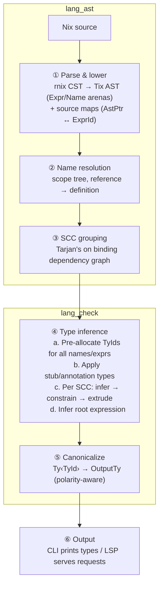

# Internals

This section covers implementation details for contributors and anyone curious about how tix works under the hood. None of this is needed to use tix effectively.

## Workspace crates

Six crates under `crates/`, listed in pipeline order:

| Crate | Role |
|-------|------|
| `lang_ast` | Parse Nix via rnix, lower to Tix AST, name resolution, SCC grouping |
| `lang_ty` | Type representation: `Ty<R, VarType>` during inference, `OutputTy` for display |
| `comment_parser` | Parse type annotations from doc comments and `.tix` stub files |
| `lang_check` | SimpleSub type inference engine — the core of the project |
| `lsp` | LSP server: hover, completions, go-to-def, diagnostics, rename, etc. |
| `cli` | CLI entry point, project-level batch checking |

## Pipeline overview

Type-checking a Nix file flows through six phases:



### Phase 1: Parse & lower

**Entry:** `lang_ast::module_and_source_maps(db, file)`

Nix source is parsed by [rnix](https://github.com/nix-community/rnix-parser) into a Rowan CST, then lowered to Tix's own AST. The AST uses arena allocation — every expression and name gets an `ExprId` / `NameId` index into flat vectors. A bidirectional `ModuleSourceMap` links AST nodes back to source positions for LSP features and error reporting. Doc comments are gathered during lowering and inline type aliases (`type Foo = ...;`) are extracted.

### Phase 2: Name resolution

**Entry:** `lang_ast::name_resolution(db, file)`

Two sub-phases:

1. **Scope building** — walks the AST to create a scope tree. Each `let`, recursive attrset, and lambda introduces a scope with its defined names. `with` expressions create special scopes that defer lookup to the environment value.
2. **Reference resolution** — for each `Expr::Reference`, looks up the name through ancestor scopes. Results are one of: a local definition (`NameId`), a builtin (e.g. `null`, `map`), a `with`-environment lookup, or unresolved. A reverse index (`NameId → Vec<ExprId>`) is also built for find-references / rename.

### Phase 3: SCC grouping

**Entry:** `lang_ast::group_def(db, file)`

Builds a dependency graph between bindings (which name references which other name) and runs Tarjan's algorithm to compute strongly connected components. Each SCC becomes a `DependentGroup` — a set of mutually-recursive definitions that must be inferred together. Non-recursive bindings get their own single-element group. Groups are topologically sorted so each group is inferred only after its dependencies.

### Phase 4: Type inference

**Entry:** `lang_check::check_file(db, file)`

This is where SimpleSub runs. The main orchestrator (`CheckCtx::infer_prog_partial`) proceeds in stages:

**Pre-allocation.** A fresh `TyId` is allocated for every name and expression in the module upfront. This lets recursive definitions reference types before they're fully inferred.

**Stub application.** If the entry expression is a lambda with doc-comment annotations (e.g. `/** type: lib :: Lib */`), those types are applied to the parameter slots before inference begins, so they flow into all downstream bindings.

**Per-SCC iteration.** For each group:

1. **Enter a new binding level** for let-polymorphism.
2. **Infer each definition** via `infer_expr` — a single-pass walk over the AST that allocates type variables and calls `constrain(sub, sup)` inline as it discovers subtyping relationships.
3. **Resolve deferred constraints** — overloaded operators (`+`, `*`, etc.), `with`-environment lookups, and attrset merges are resolved once enough type information has accumulated.
4. **Extrude and generalize** — variables created at this level are copied to fresh variables at the parent level with bounds linked via constraints. This is SimpleSub's replacement for the traditional HM generalize/instantiate pair.

**Root inference.** The module's entry expression is inferred and any remaining pending constraints are resolved.

### Phase 5: Canonicalization

**Entry:** `Collector::finalize_inference()`

Converts the internal bounds-based representation (`Ty<TyId>`) to a display-ready `OutputTy` tree. This is polarity-aware:

- **Positive positions** (outputs, covariant) — a variable expands to the union of its lower bounds. A variable bounded by `{int, string}` becomes `int | string`.
- **Negative positions** (inputs, contravariant) — a variable expands to the intersection of its upper bounds.

Negation types are normalized using Boolean algebra (De Morgan, double-negation elimination, contradiction/tautology detection). The result is an `InferenceResult` mapping every `NameId` and `ExprId` to its `OutputTy`.

### Phase 6: Output

The CLI prints binding types and the root expression type. The LSP serves the `InferenceResult` to power hover, completions, diagnostics, inlay hints, and other features.

## Cross-file inference

When a file contains `import ./other.nix`, tix resolves it demand-driven:

1. **Import scanning** — `scan_literal_imports()` finds literal `import <path>` patterns. Dynamic imports (where the path is computed) remain unconstrained.
2. **Demand-driven analysis** — an `InferenceCoordinator` manages concurrent file inference. When file A imports file B, B is inferred first (with cycle detection). The coordinator handles parallelism via rayon for batch project checking (`tix check`).
3. **Type integration** — the imported file's root `OutputTy` is used as the type of the `import` expression. For `callPackage ./file.nix {}` patterns, tix recognizes the convention and peels the outer lambda layer.

Files outside the project scope (e.g. transitive nixpkgs imports) get `⊤` — inference stays local to the project boundary.

### Layered inference in `tix check`

In batch mode (`tix check`), files are inferred in topological layers based on their import dependencies:

1. **Import scanning** — during Phase 1 (sequential prepare), each file's import targets are scanned to build a file-level dependency graph.
2. **SCC computation + layering** — Tarjan's algorithm computes strongly-connected components (SCCs), then a condensation DAG is topologically sorted into layers. Layer 0 contains leaf files (no in-project dependencies); each subsequent layer depends only on prior layers.
3. **Layer-by-layer inference** — files within each layer run in parallel via rayon. Dependencies from prior layers have their signatures cached in the `InferenceCoordinator`, so imports resolve to real types instead of `⊤`. Files within the same SCC (mutual imports) get `⊤` for intra-SCC imports.
4. **Reference-counted eviction** — after each layer, signatures whose importers have all been processed are evicted from the cache, keeping memory bounded to the dependency "frontier" rather than the entire project.

## Stub integration

`.tix` stub files provide types for code that can't be inferred (nixpkgs lib, etc.). The `TypeAliasRegistry` in `aliases.rs` loads stubs from three sources:

1. **Built-in stubs** (`stubs/lib.tix`) — shipped with tix, covering core nixpkgs lib functions.
2. **Project stubs** — loaded from `--stubs` CLI flags or `tix.toml` config.
3. **Inline aliases** — `type Foo = ...;` declarations in doc comments, merged into the registry during inference.

Top-level `val` declarations (e.g. `val mkDerivation :: ...`) provide types for unresolved names automatically — no annotation needed. Module blocks (`module lib { ... }`) auto-generate a capitalized type alias (`Lib`) for use in doc-comment annotations.

## Type theory background

### What SimpleSub gives us

Most type inference algorithms make you choose: you can have **subtyping** (like TypeScript, where `int` is assignable to `int | string`) or you can have **full inference** (like ML/Haskell, where the compiler figures out all the types). SimpleSub gets both.

Concretely, tix's type system provides:

- **Type inference** — types are inferred from usage, not declared. You write `x: !x` and tix infers `bool -> bool`.
- **Subtyping** — a `{ name: string, age: int }` can be passed where `{ name: string, ... }` is expected. A function returning `int` can be used where `int | string` is expected. Types have a natural "is-a" relationship.
- **Parametric polymorphism** — a function like `id = x: x` gets a generic type `a -> a` that works for any type, not a single concrete type.
- **Let generalization** — each `let` binding gets its own polymorphic type, so `id` can be applied to both `int` and `string` in the same scope without conflict.
- **Union and intersection types** — `if cond then 1 else "hi"` is `int | string` (a union). A function parameter constrained to be both a number and a string gets an intersection type, which simplifies to `never` (uninhabited) — indicating a type error.
- **Row polymorphism** — `getName = x: x.name` accepts any attrset with a `name` field. The type is `{ name: a, ... } -> a` — the `...` means "other fields are allowed."

The key insight of SimpleSub is that subtyping constraints can be recorded as bounds on type variables (lower bounds for what flows *in*, upper bounds for what flows *out*) and resolved lazily during canonicalization. This avoids the complexity of traditional constraint solvers while keeping inference complete.

Tix extends SimpleSub with [Boolean-Algebraic Subtyping](https://github.com/fo5for/sebas) (BAS) from Chau & Parreaux (POPL 2026), which adds negation types (`~null`, `~string`) for type narrowing in conditional branches.

For the full theory, see Parreaux's [The Simple Essence of Algebraic Subtyping](https://lptk.github.io/programming/2020/03/26/demystifying-mlsub.html) (ICFP 2020).

### Key design decisions

- **Bounds-based variables, not union-find**: type variables store upper/lower bounds; `constrain(sub, sup)` propagates bounds inline (no separate solve phase).
- **Extrude replaces instantiate/generalize**: deep-level variables are copied to fresh variables at the current level with bounds linked via subtyping constraints. This is SimpleSub's key insight — it replaces the traditional Hindley-Milner generalize/instantiate pair with a single operation.
- **Two type representations**: `Ty<R, VarType>` during inference (includes `Neg`, `Inter`, `Union` for narrowing); `OutputTy` after canonicalization (has Union/Intersection/Neg).
- **Polarity-aware canonicalization**: positive positions expand to union of lower bounds; negative positions expand to intersection of upper bounds.
- **SCC grouping**: mutually recursive bindings are grouped into strongly connected components and inferred together. Each SCC is fully inferred before moving to the next.
- **Deferred overload resolution**: operators like `+` are resolved after the SCC group is fully inferred, when more type information is available.
- **Salsa** for incremental computation (query caching in the LSP).

## How narrowing works

Narrowing uses first-class intersection types during inference (following the [MLstruct approach from OOPSLA 2022](https://infoscience.epfl.ch/record/299030)). When `isString x` is the condition:

- **Then-branch**: x gets type `α ∧ string` (an intersection of the original type variable with string)
- **Else-branch**: x gets type `α ∧ ~string` (intersection with negation)

These intersection types are structural — they flow through constraints, extrusion, and generalization like any other type. This means narrowing information survives let-polymorphism:

```nix
let f = x: if isNull x then 0 else x; in f
# f :: a -> int | ~null
# The ~null constraint on the else-branch's x is preserved
```

When a narrowed type like `α ∧ ~null` flows into a function that expects `string`, the solver applies variable isolation (the "annoying" constraint decomposition from MLstruct): `α ∧ ~null <: string` becomes `α <: string | null`, correctly constraining α without losing the negation information.

### Negation normalization

Negation types are normalized during canonicalization using standard Boolean algebra rules:

- **Double negation**: `~~T` simplifies to `T`
- **De Morgan (union)**: `~(A | B)` becomes `~A & ~B`
- **De Morgan (intersection)**: `~(A & B)` becomes `~A | ~B`
- **Contradiction**: `T & ~T` or `string & int` in an intersection is detected as uninhabited and displayed as `never`
- **Tautology**: `T | ~T` in a union is detected as universal and simplifies to `any` (the top type)
- **Redundant negation**: `{name: string} & ~null` simplifies to `{name: string}` (attrsets are inherently non-null)
- **Union absorption**: `{...} | {x: int, ...}` simplifies to `{...}` — an open attrset with fewer required fields subsumes more specific open attrsets
- **Intersection factoring**: `(A | C) & (B | C)` simplifies to `C | (A & B)` — shared members across all union terms are factored out using the distributive law

## LSP architecture

### Event coalescing

Instead of per-file timer debouncing, the LSP uses an event-coalescing architecture inspired by rust-analyzer. `didChange` and `didOpen` notifications send events to a single analysis loop. The loop drains all pending events before starting analysis, naturally batching rapid edits without artificial delays. Diagnostic publication is deferred behind a 200ms quiescence timer to prevent flickering during rapid typing, but analysis results are available to interactive requests (hover, completion) immediately.

Completion works responsively during editing. When a completion request arrives before the latest analysis finishes, the server first tries full completion against the fresh parse tree. If that fails, it falls back to a syntax-only path that provides both dot completion (via name-text lookup against the stale analysis) and identifier completion (variable names from the scope chain).

### Cancellation

When a new edit arrives for a file that's currently being analyzed, the in-flight analysis is cancelled via a cooperative cancellation flag. The inference engine checks this flag between SCC groups and periodically during constraint propagation, so cancellation typically takes effect within milliseconds.

## Key source files

| File | Role |
|------|------|
| `lang_ast/src/lib.rs` | Module, Expr, AST arena types |
| `lang_ast/src/lower.rs` | rnix CST → Tix AST lowering |
| `lang_ast/src/nameres.rs` | Scope analysis, name resolution, SCC grouping |
| `lang_ast/src/narrow.rs` | Guard recognition, NarrowPredicate enum |
| `lang_ty/src/lib.rs` | `Ty<R, VarType>` and `OutputTy` type definitions |
| `comment_parser/src/tix_decl.pest` | `.tix` file grammar |
| `lang_check/src/lib.rs` | `check_file` entry point, `InferenceResult` |
| `lang_check/src/infer.rs` | Orchestration, SCC iteration, extrude, generalization |
| `lang_check/src/infer_expr.rs` | Single-pass AST inference walk |
| `lang_check/src/constrain.rs` | Core subtyping constraint function |
| `lang_check/src/collect.rs` | Canonicalization from bounds to OutputTy |
| `lang_check/src/storage.rs` | Bounds-based type variable storage |
| `lang_check/src/builtins.rs` | Nix builtin type synthesis |
| `lang_check/src/aliases.rs` | TypeAliasRegistry (loads stubs, resolves aliases) |
| `lang_check/src/imports.rs` | Import scanning, demand-driven cross-file resolution |
| `lang_check/src/coordinator.rs` | Concurrent multi-file inference coordinator |

## References

- Parreaux, [The Simple Essence of Algebraic Subtyping](https://lptk.github.io/programming/2020/03/26/demystifying-mlsub.html) (ICFP 2020) — the core type system
- Parreaux & Chau, [MLstruct](https://infoscience.epfl.ch/record/299030) (OOPSLA 2022) — negation types and pattern matching
- Chau & Parreaux, [Simple Essence of Boolean-Algebraic Subtyping](https://github.com/fo5for/sebas) (POPL 2026) — BAS reference implementation
- See `docs/internal/narrowing-design.md` for full narrowing design rationale
